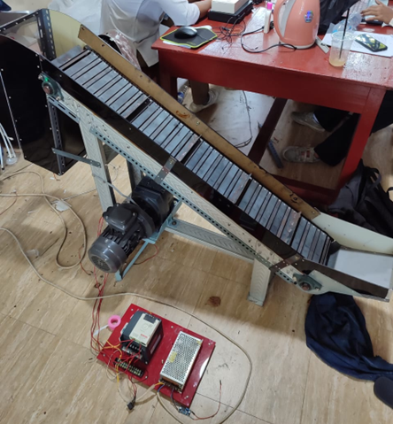
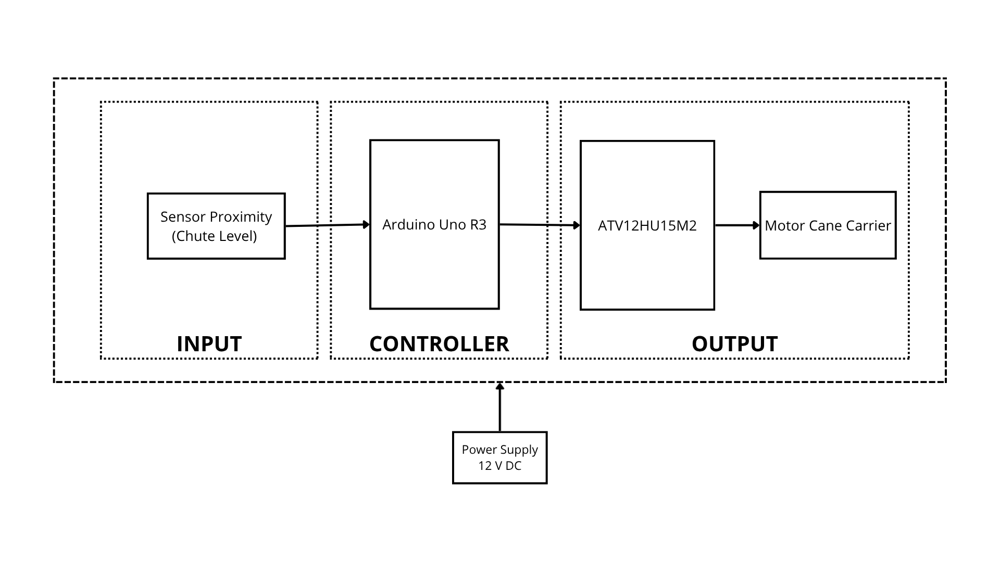
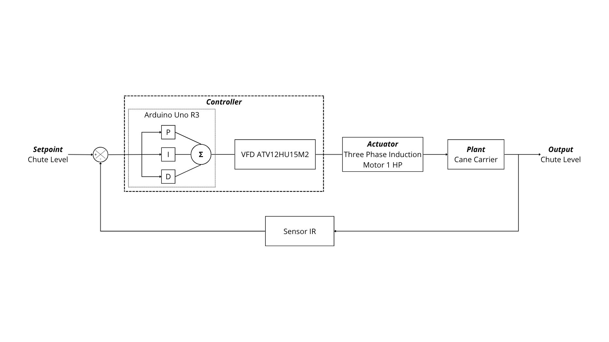
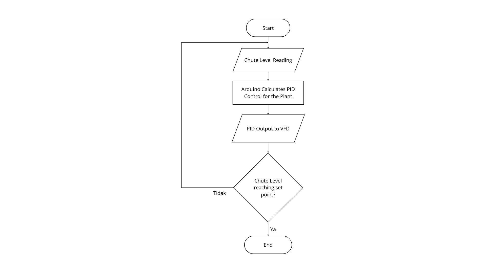
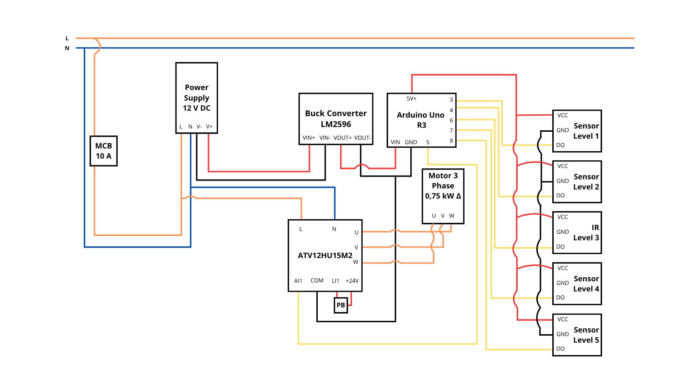

Automatic Cane Feeding Control

This is my final project for achieving Bachelor of Applied Engineering. This project focuses on implementing a Proportional-Integral-Derivative control system to regulate the speed of a cane carrier motor in a sugar factory based on the sugarcane bagasse level in the chute. The goal is to minimize frequent sugarcane pile-ups caused by a mismatch between motor speed and material flow.

  

🛠️ System Architecture
The following diagram illustrates the overall system architecture:

  

  

Component Description:

- Proximity Sensor: Monitors the bagasse level in the chute.
- Arduino Uno: Processes sensor data and runs the PID algorithm.
- VFD (ATV12HU15M2): Regulates motor speed based on the PWM signal from the Arduino.
- 3-Phase Induction Motor: Drives the cane carrier.
- Power Supply & Buck Converter: Provides power for the entire system.

🔄 System Flowchart
The system workflow is defined by the following flowchart:

  

Flowchart Explanation:

- The system starts with component initialization.
- The proximity sensor reads the material level in the chute.
- Arduino compares the actual level with the setpoint.
- Based on the error, the PID algorithm calculates the PWM value.
- The PWM signal is sent to the VFD to adjust the motor speed.
- The process repeats in real-time.

⚡ Wiring Diagram
The electrical wiring for the cane carrier control system is shown below:

  

Wiring Description:

- Arduino Pins 2-8: Connected to infrared proximity sensors.
- Arduino Pin 9 (PWM): Output to VFD (Analog Input AII).
- VFD Output (U, V, W): Drives the 3-phase induction motor.
- 12V Power Supply: Powers the Arduino via a buck converter (12V → 9V).
- Push Button: Connected to the VFD (L11) for manual start/stop.