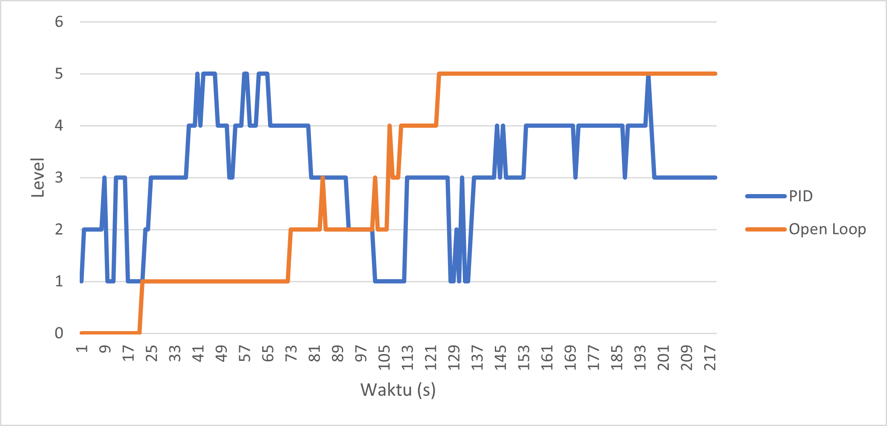

# Automatic Cane Feeding Control

  

## 📄 What is this?
This is my final project for achieving a Bachelor of Applied Engineering in Automation Engineering Technology at Institut Teknologi Sepuluh Nopember. This project focuses on implementing a Proportional-Integral-Derivative (PID) control system to regulate the speed of a cane carrier motor in a sugar factory based on the sugarcane bagasse level in the chute, using a cane carrier prototype. The goal is to minimize frequent sugarcane pile-ups caused by a mismatch between motor speed and material flow.
The system was developed using:

- Microcontroller: Arduino Uno R3
- Actuator: 3-Phase Induction Motor
- Sensor: 5 Infrared Proximity Sensor (for level detection)
- PID Tuning Method: Ziegler-Nichols

Test results show the system successfully minimized pile-ups with a steady-state error of 0.89 and 25% overshoot. The system only experienced a maximum level pile-up for 13 seconds out of a total 219 seconds of operation.

You are welcome to use my source code and system design. For improved performance, I recommend implementing more precise chute level measurement sensors, such as load cells, to enhance error calculation accuracy and system response. The source folder contains .ino files for the Arduino implementation and MATLAB files for system identification and PID parameter calculation.

## 🛠️ System Architecture
The following diagram illustrates the overall system architecture:

  

Component Description:

- Proximity Sensor: Monitors the bagasse level in the chute.
- Arduino Uno: Processes sensor data and runs the PID algorithm.
- VFD ATV12HU15M2: Regulates motor speed based on the PWM signal from the Arduino.
- 3-Phase Induction Motor: Drives the cane carrier.
- Power Supply & Buck Converter: Provides power for the entire system.

## 🔄 System Flowchart
The system workflow is defined by the following flowchart:

   

Flowchart Explanation:

- The system starts with component initialization.
- The proximity sensor reads the material level in the chute.
- Arduino compares the actual level with the setpoint.
- Based on the error, the PID algorithm calculates the PWM value.
- The PWM signal is sent to the VFD to adjust the motor speed.
- The process repeats in real-time until the push button for LI1 is set to be not connected.

## ⚡ Wiring Diagram
The electrical wiring for the cane carrier control system is shown below:

  

Wiring Description:

- Arduino Pins 2-8: Connected to infrared proximity sensors.
- Arduino Pin 9 (PWM): Output to VFD (Analog Input AII).
- VFD Output (U, V, W): Drives the 3-phase induction motor.
- 12V Power Supply: Powers the Arduino via a buck converter (12V → 9V).
- Push Button: Connected to the VFD (LI1) for manual start/stop.

## 📈 Test Results

### PID Control vs. Open Loop Performance
> These data can be acquired in src/MATLAB/SystemIdentificationData.xlsx

| Parameter | Open Loop | PID Control |
|:--:|:--:|:--:|
| Average Error | - | 0.89   |
| Average PWM (8-bit) | - | 142.39 |
| Overshoot | Full Saturation | 25% |
| Rise Time | - | 37 seconds |
| Max Pile-up Duration | 95 seconds (from 124s-219s) | 13 seconds (out of 219s) |

  

